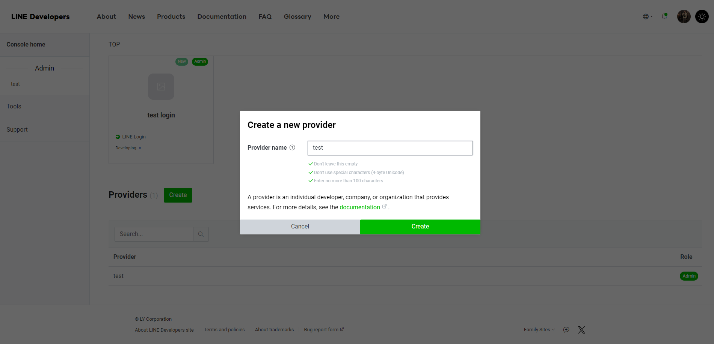
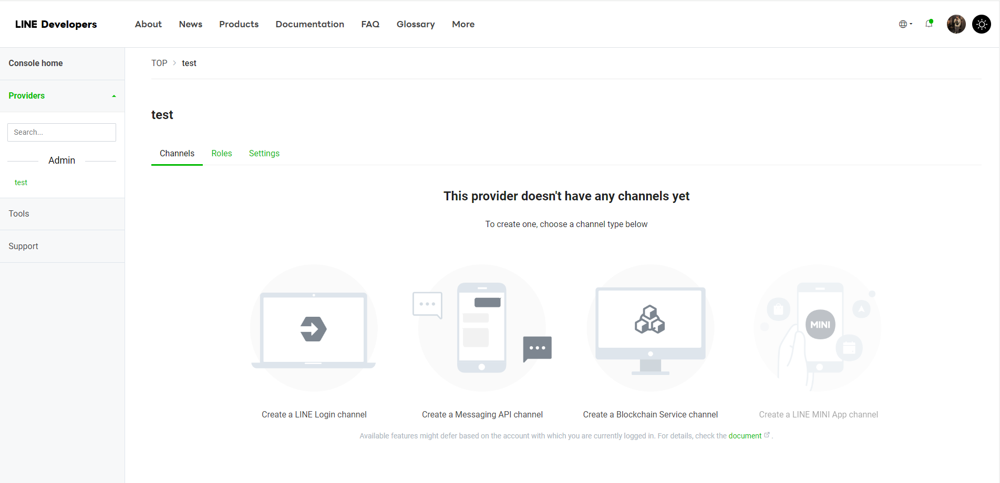
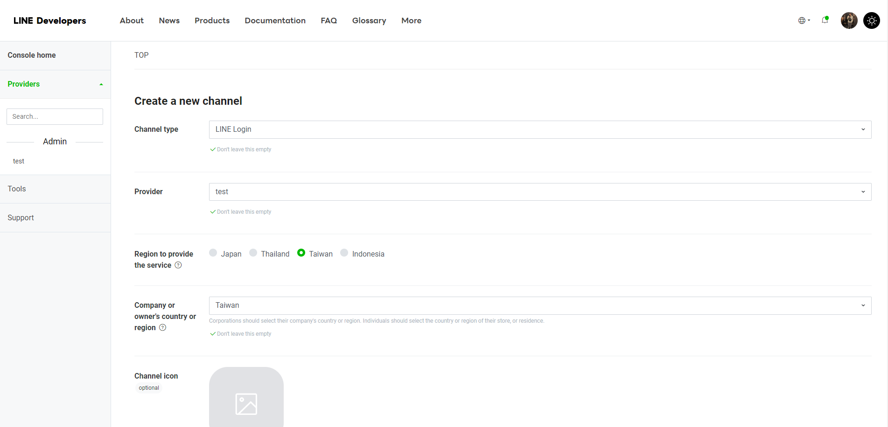
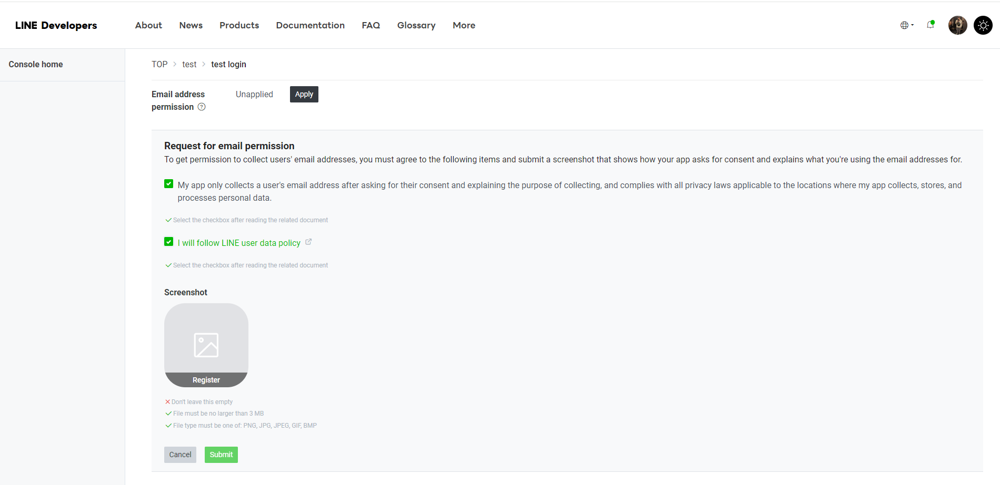
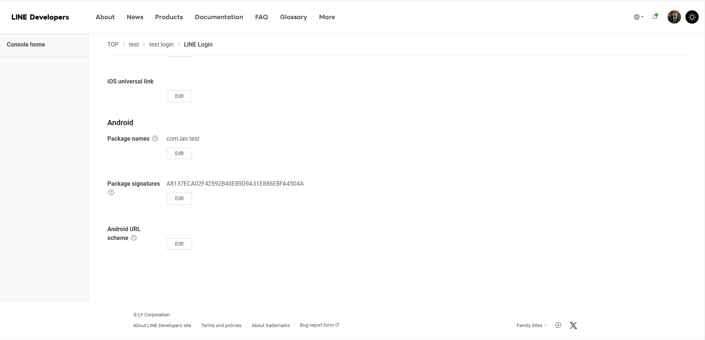

# LINE Login

### 1. [LINE Developer Console](https://developers.line.biz/console/) 建立Provider
+ 

### 2. 在Provider中建立LINE Login channel
+ 
+ 

### 3. 開通OpenID權限
+ 進入Login channel的Basic setting，點擊下方Email address permission的Apply按鈕
+ 選項打勾
+ 截圖部分，上面是要求【請截圖顯示你的應用程式是如何請求Email以及你會怎麼使用這個Email】，說明實在是太過籠統，網路上有些人是上傳公司或應用程式LOGO，有些人是截圖此頁，都可以
+ 

### 4. 登錄APPID與SHA金鑰
+ 進入Login channel的LINE Login填入資訊
+ 一行一個金鑰
+ [怎麼取得SHA金鑰](https://github.com/IanWangIITZDAWG/SHA-key)
+ 

### 5. Flutter專案新增【flutter_line_sdk】套件

### 6. 修改main()
+ 修改main.dart中的main()
+ Channel ID在channel的Basic setting中
```dart
import 'package:flutter_line_sdk/flutter_line_sdk.dart';

void main() async {
  WidgetsFlutterBinding.ensureInitialized();
  await LineSDK.instance.setup("Channel ID").then((_) {
    print("LineSDK Prepared");
  });

  runApp(const MyApp());
}
```

### 6. 開始使用
+ [查看套件使用方法](https://pub.dev/packages/flutter_line_sdk)
```dart
import 'package:flutter_line_sdk/flutter_line_sdk.dart';

Future<LoginResult?> lineLogin(context) async {
  try {
    final lineAccount = await LineSDK.instance.login(scopes: ["profile", "openid", "email"]);
    return lineAccount;
  } catch (e) {
    return null;
  }
}
```